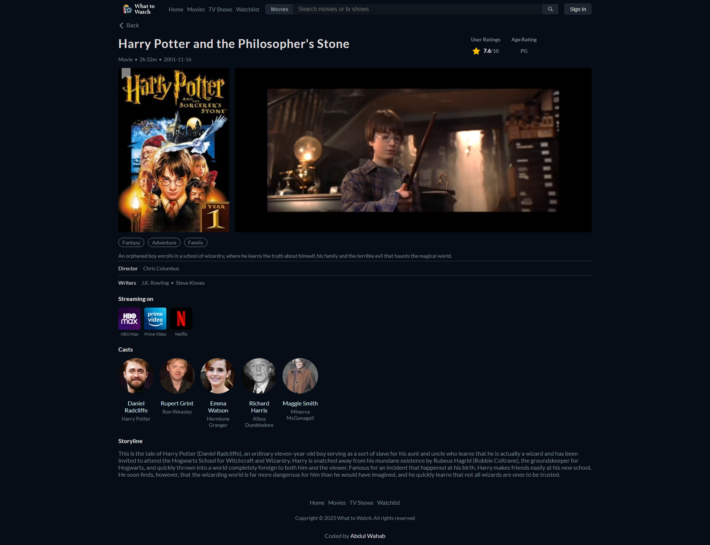

# What to Watch

"What to Watch" is a mobile-first, single-page React application that allows users to explore movies, TV shows, and celebrities. It is fully responsive, providing a seamless experience across various screen sizes. Utilizing React Router DOM, navigation between pages is effortless. With a focus on reusable components, the app offers a user-friendly interface for discovering exciting content.

## Table of Contents

-   [Screenshots](#screenshots)
-   [Links](#links)
-   [Setup](#setup)
-   [How did I build it?](#how-did-i-build-it)
-   [What problem did I set out to fix?](#what-problem-did-i-set-out-to-fix)
-   [What were some of the design decisions?](#what-were-some-of-the-design-decisions)
-   [What packages did I use to solve challenges?](#what-packages-did-i-use-to-solve-challenges)
-   [What did I learn?](#what-did-i-learn)
-   [What will I do differently next time?](#what-will-i-do-differently-next-time)
-   [Author](#author)

## Screenshots




## Links

[Live Site URL](https://abdulwahabse.github.io/whattowatch)

## Setup

To run this project locally:

```
npm install && npm run dev
```

## How did I build it?

I built "What to Watch" as a single-page application using React and styled it using Sass/SCSS. The development process followed a mobile-first approach, ensuring the application is fully responsive across various screen sizes. To handle the navigation and different pages, I utilized React Router DOM, making it easy for users to explore movies, TV shows, and celebrities seamlessly.

## What problem did I set out to fix?

The primary goal of "What to Watch" was to create a platform for users to explore movies, TV shows, and celebrities in an organized and user-friendly manner. By providing a single-page application, users can easily access all the relevant information without the need for multiple page reloads. The application aims to simplify the process of discovering exciting content to watch and getting to know more about their favorite actors and actresses.

## What were some of the design decisions?

Several design decisions were made to ensure a smooth and pleasant user experience. These include adopting a mobile-first approach, enabling optimal usage on various devices. The choice of React as the framework allowed for the creation of reusable components, making the application more maintainable and efficient. The utilization of Sass/SCSS for styling facilitated better code organization and enhanced maintainability. Furthermore, the decision to use React Router DOM simplified page navigation and provided a seamless experience to users.

## What packages did I use to solve challenges?

To address the challenges of building a dynamic single-page application, I leveraged several packages and technologies. Notably, React played a crucial role in efficiently managing the application's state and rendering components. Sass/SCSS enabled me to create more maintainable and organized stylesheets, improving the application's overall design. Additionally, React Router DOM provided a straightforward solution for handling page navigation and creating a smooth user experience.

## What did I learn?

Throughout the development of "What to Watch," I gained valuable experience in several areas. Working with React taught me the importance of dividing applications into reusable components, which significantly simplified development and maintenance. The mobile-first approach helped me understand the importance of responsive design and accommodating various screen sizes. Leveraging external packages like React Router DOM allowed me to integrate advanced features without reinventing the wheel.

## What will I do differently next time?

For future iterations of "What to Watch" or similar projects, I plan to focus on enhancing user interactions and visual appeal. Specifically, I aim to implement smooth animations to make the application more engaging and enjoyable to use. Additionally, I will work on providing a seamless click and drag to scroll feature, optimizing the experience for non-touch devices. Moreover, I recognize the current application is static, and next time, I intend to extend it to a full-stack application by creating a backend separately. This will enable dynamic content updates and interaction with databases, taking "What to Watch" to the next level of functionality and user engagement.

## Author

-   Abdul Wahab - [@abdulwahabse](https://github.com/abdulwahabse)
